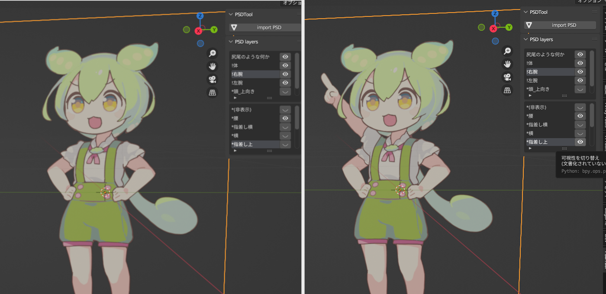

# PSDTool for Blender (旧psd to plane)
- PSDファイルをプレーンオブジェクトとして取り込む機能を追加するBlenderアドオンです。
- 取り込まれたpsdファイルはプレーンオブジェクトにテクスチャとして適用され表示されます。
- レイヤーの表示非表示も切り替え可能です。
- 動作確認済みver：blender v3.6.11

## ダウンロード
最新版は[ここをクリック](https://github.com/laTH380/PSDToolKit-for-blender/releases/download/v1.1.0/PSDTool_for_Blender_1.1.0.zip)

## 使用方法
- 一般的なアドオンと同じように有効化してください。
- ツールバーにpsdインポートとレイヤー操作のための専用UIが表示されます。
- 画像オブジェクト追加パネルにもpsdをインポートするボタンが表示されます。

## QandA
### 今後のアップデート予定は？
- [PSDToolKit](https://oov.github.io/aviutl_psdtoolkit/index.html)と同等の機能を追加し、Blender内でPSD製立ち絵を簡単に使えるようにします。
- Blender4.2.4へのサポート
- テクスチャを切り替えるアニメーションを簡単に追加できる機能
### v4系に対応しますか？
~~LTS版がリリース後に対応予定です。~~ v4.2.4に対応予定です。

## 更新履歴
- 1.0.0 - 2024/6/24 初版公開
- 1.1.0 - 2024/11/28 レイヤー表示切り替え機能追加、アドオン名を「PSDTool for Blender」に変更

## ライセンス
このプログラムは、GNU General Public License（GPL）に基づいて配布されています。

1. 自由な使用
このプログラムは、自由に使用、改変、再配布することができます。

2. ソースコードの公開
プログラムのソースコードが提供されています。ソースコードを入手し、内容を確認したり、修正したりすることができます。

3. 無保証
このプログラムは無保証で提供されています。商業利用や特定の目的への適合性についての保証はありません。

4. 詳細
GPLの詳細なライセンス条項については、プログラムに同梱されているライセンスファイルを参照してください。または、以下のリンクから確認できます。
GNU General Public License (日本語訳)